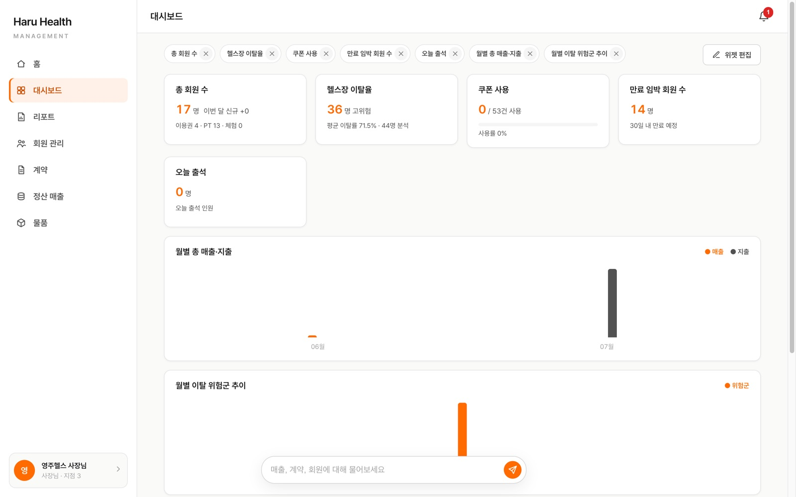
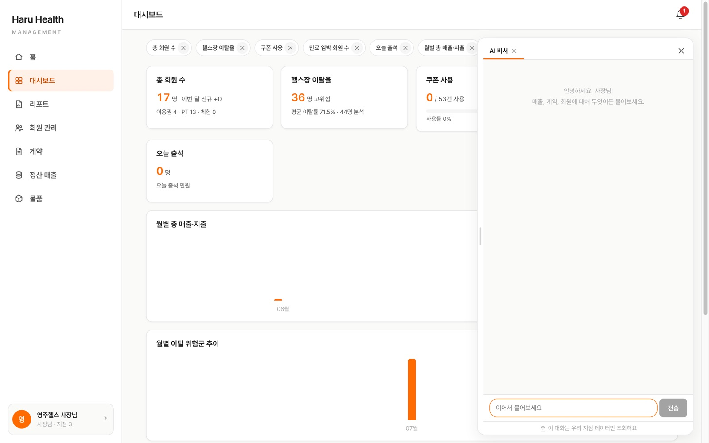
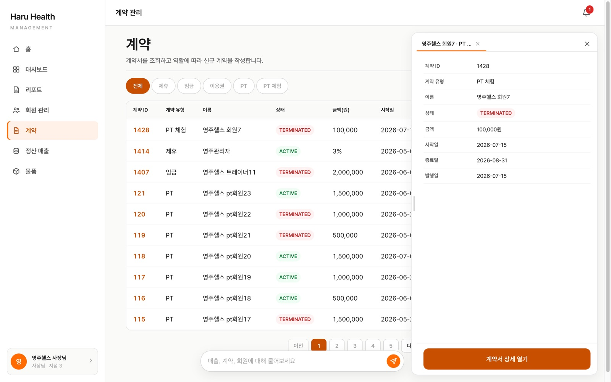
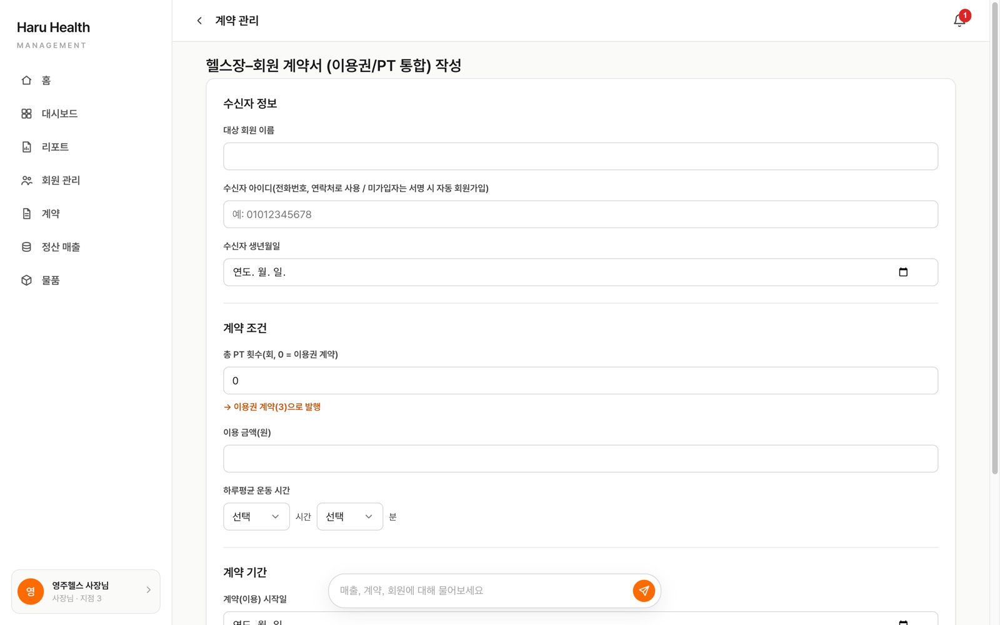

# Haru Health — 체육관 B2B SaaS 관리 포털

> [!IMPORTANT]
> ### 📌 포트폴리오 바로가기
> 두 프로젝트(체육관 SaaS · 반려견 케어)의 담당 기능 전체를 실제 화면과 함께 정리한 문서입니다.
>
> **[🔗 브라우저에서 바로 보기](https://htmlpreview.github.io/?https://github.com/greyth93-ship-it/health_Project/blob/sub/docs/portfolio.html)** · **[⬇ portfolio.html 내려받기](docs/portfolio.html)** (파일 페이지 우측 상단 Download raw file → 브라우저로 열기)

---

아래는 프로젝트 상세(화면 · 아키텍처 · 구현 내용 · 실행 방법)입니다.

관계사(ADMIN) → 체육관 사장님(OWNER) → 트레이너(TRAINER) → 회원(MEMBER)으로 이어지는 **멀티테넌트 SaaS**입니다.
회원 이탈 방지를 목표로 계약·대시보드·쿠폰·AI 비서를 한 포털에서 운영합니다.

- 기간: 2026.07 – 2026.08 · 4인 팀 프로젝트
- 구성: `healthcareBack`(Spring Boot + MyBatis) · `healthcareFront`(React + Vite) · `healthModel`(이탈 예측 ML)
- **이 README는 구영주(백엔드 개발자)의 담당 범위를 기준으로 작성했습니다.** 팀원 담당 영역은 아래 "팀 구성"에 표시했습니다.

## 화면

| 사장님 대시보드 (위젯 7종 · 커스텀) | AI 비서 (Tool Use · 드로어) |
|---|---|
|  |  |
| **계약 관리 (유형 5종 · 상세 드로어)** | **계약 발행폼 (서버 측 유형 판정)** |
|  |  |

## 아키텍처

```
[React 19 / Vite]  ←→  [Spring Boot 3.5 / Java 21 / MyBatis]  ←→  [FastAPI + XGBoost·SHAP]
   :5173  /fitb(B2B) /fitc(B2C)        :8080  JWT · SSE                 :8000  이탈 예측(팀원)
                                          │
                              [Supabase PostgreSQL]  ·  [Anthropic Claude (Tool Use)]
```

| 계층 | 스택 |
|---|---|
| 백엔드 | Java 21, Spring Boot 3.5, MyBatis, Spring Security(JWT), SseEmitter(AI 스트리밍), Anthropic Java SDK |
| 프론트 | React 19, Vite, react-router-dom 7, CSS 디자인 토큰(`src/index.css` 단일 원천), ESLint |
| DB | PostgreSQL (Supabase), `h_` 접두 테이블 |
| AI | Claude Tool Use — 백엔드 오케스트레이터가 도구 실행·권한·테넌트 격리를 강제 |

## 내가 만든 것

### 백엔드 `healthcareBack/app/src/main/java/com/health/app`

| 패키지 | 내용 |
|---|---|
| `contract` | 계약 유형 5종(제휴·임금·이용권·PT·PT 체험)의 발행·서명·상태 전이(`DRAFT→ISSUED→SIGNED→ACTIVE→TERMINATED`), 역할별 리스트·서버 페이징·검색, 미가입 수신자 자동가입을 서명과 한 트랜잭션으로 처리, 만료 sweep |
| `dashboard` | OWNER 위젯 7종 집계(각 도메인 서비스를 주입해 호출), 사용자별 위젯 on/off·순서 저장, 데이터 없음 위젯 409 잠금 |
| `ai` | Claude Tool Use 오케스트레이터 — 화이트리스트 READ 도구 9종을 서비스 메서드에 직접 바인딩, `gym_id`/`username`은 LLM 인자를 버리고 JWT에서 주입, 전 도구 호출 감사 로그(`h_ai_tool_audit`), 권한 없는 역할은 LLM 호출 전 차단, SSE 턴 단위 스트리밍, 크레딧 소진 시 ADMIN 알림 |
| 운영 데이터 정비 | **운영 DB 회원 1,274명의 평문 비밀번호를 건별 오토커밋 방식으로 무중단 BCrypt 전환**(단일 트랜잭션은 BCrypt 비용 누적으로 커넥션 타임아웃 → 중단돼도 이어서 재실행 가능한 구조, 완료 후 임시 핸들러·일회성 SQL 영구 삭제). 계약 금액 단위 불일치(결제 원 / 계약 만원) 발견 → `amount` 1,288행 ×10,000 정합, 이미 원 단위였던 4건은 결제 대조로 제외 |
| `config` | CORS 허용 주소 환경변수화(`FRONTEND_SERVER_URL`, 콤마 구분) |

### 프론트 `healthcareFront/src`

- `App.jsx` — B2C(`/fitc`)·B2B(`/fitb`) **중첩 라우팅**으로 담당자 간 파일 소유 경계 분리, 최초 진입 시 로그인
- `ai/AiChat.jsx`, `ai/AiPanel.jsx` — 드로어 AI 탭, 플로팅 입력바, 차트/리스트 카드, 바로가기 버튼(레지스트리 메타 기반)
- 계약 — `Contractpage.jsx`(서버 페이징·칩 필터·검색), `ContractNew.jsx`(통합 발행폼), `ContractDetail.jsx`(서명 패드·이력), `TrialTargetPage.jsx`
- `Dashboard.jsx` — 위젯 7종 렌더, 편집 모달(드래그 순서 변경), AI 질문 카드·태스크 브리핑
- 디자인 시스템 — `index.css` 토큰(색·타이포·라운드·간격·보더) 단일 원천, 하드코딩 색상 416회 수렴, 타이포 스케일 Apple HIG 기준 11종 개편(573건 치환), `components/Button.css` 공용 버튼, `components/B2bDrawer.jsx` 우측 통합 드로어, 전 화면 리스킨(정산 요약 레일 · 리스트 빈 상태 공통 규격 등, API 무변경)

### 설계 원칙

- **테넌트 격리는 코드로 강제** — 모든 집계·조회는 JWT의 `gym_id` 기준, 클라이언트가 보낸 식별자는 신뢰하지 않음
- **LLM은 신뢰 경계 밖** — 모델은 "어떤 도구를 부를지"만 결정, 실행·권한·인자 주입·감사는 오케스트레이터가 담당. 프롬프트는 응대 계층일 뿐 보안 원천이 아님
- **서버가 최종 판정** — 계약 유형은 `quantity`로 서버가 판정, 발행 권한은 서비스 레이어에서 강제

## 실행

### 백엔드

```bash
cd healthcareBack
cp .env.example .env        # 값 채우기 (DB_URL 등)
cd app && ./gradlew bootRun # :8080
```

`.env` 항목: `DB_URL`, `DB_USERNAME`, `DB_PASSWORD`, `JWT_SECRET_KEY`, `BACKEND_SERVER_URL`, `FRONTEND_SERVER_URL`, `FASTAPI_SERVER_URL`, `AI_API_KEY`, `AI_MODEL`
`FRONTEND_SERVER_URL`은 CORS 허용 원본이므로 **브라우저에서 여는 프론트 주소와 정확히 일치**해야 합니다(예: `http://localhost:5173`).

### 프론트

```bash
cd healthcareFront
cp .env.example .env        # VITE_BACKEND_URL, VITE_PYTHON_URL
npm install && npm run dev  # :5173
```

### ML 서버 (팀원 담당)

`healthModel/` — XGBoost·SHAP 이탈 예측, FastAPI/Streamlit. 대시보드의 이탈 위젯은 일 배치 결과 테이블(`h_churn_result`)을 조회합니다.

## 팀 구성 (4인)

| 영역 | 담당 |
|---|---|
| 계약 · 대시보드 · AI 비서 · 디자인 시스템 · 중첩 라우팅 · 운영 데이터 정비 | **본인** |
| 회원 인증(JWT 발급) · 쿠폰 · 알림(SSE) · 건의사항 | 팀원 |
| 정산·결제·물품 관리 | 팀원 |
| 회원/직원 관리·출석(아바타)·리포트 화면 | 팀원 |
| 이탈 예측 ML(healthModel) | 팀원 |

## 참고

- 기획·도메인 규칙 문서(`CLAUDE.md` 등)는 `.gitignore`의 `*.md` 규칙으로 저장소에 포함되지 않습니다(로컬 관리).
- 배포 서버는 팀 프로젝트 종료 후 정리했습니다. 데모는 로컬 실행으로 재현합니다.
